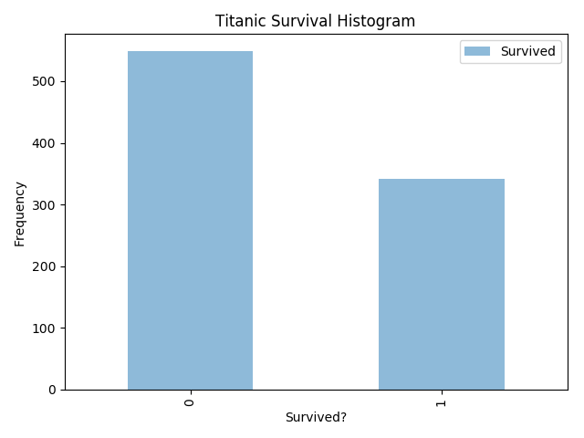
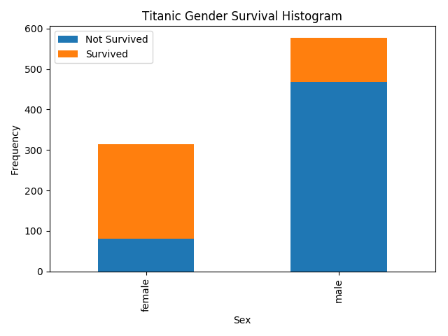

Titanic disaster classification problem (from Kaggle)
=====================================================

The goal in that Kaggle competition is to predict whether a passanger on the Titanic survived the accident ot not.
Both train and test sets are provided, but the actual class label is added to the test se as well for easier evaluation (but, ofcource is ignored in the submissions).

Here are some cool visualization plots of the data (generated by the Matplotlib Python packge). The plots visualize the distribution of the passengers who survived and grouped by their gender. It is clear that larger percentage of feamle passenger had survived the accident.




Ensemble of seven different classifiers is used:
 - TreeClassifier
 - LogisticRegression
 - RandomForestClassifier
 - GBTrees
 - XGBoost
 - KNN
 - SVM

Final log output for example:
```
Loading train data...
Loading test data...
Cleaning and transforming train data...
Cleaning and transforming test data...
Saving cleaned train data to file...
Saving cleaned test data to file...

Training classifier: TreeClassifier
Training TreeClassifier classifier completed in 0.0010464191436767578 seconds
Predicting with classifier: TreeClassifier
Predicting with TreeClassifier classifier completed in 0.0 seconds

Training classifier: LogisticRegression
Training LogisticRegression classifier completed in 0.008977413177490234 seconds
Predicting with classifier: LogisticRegression
Predicting with LogisticRegression classifier completed in 0.0 seconds

Training classifier: RandomForestClassifier
Training RandomForestClassifier classifier completed in 1.2506542205810547 seconds
Predicting with classifier: RandomForestClassifier
Predicting with RandomForestClassifier classifier completed in 0.07184123992919922 seconds

Training classifier: GBTrees
Training GBTrees classifier completed in 1.23872971534729 seconds
Predicting with classifier: GBTrees
Predicting with GBTrees classifier completed in 0.019873857498168945 seconds

Training classifier: xgboost
Training xgboost classifier completed in 0.9036173820495605 seconds
Predicting with classifier: xgboost
Predicting with xgboost classifier completed in 0.03387331962585449 seconds

Training classifier: KNN
Training KNN classifier completed in 0.001992464065551758 seconds
Predicting with classifier: KNN
Predicting with KNN classifier completed in 0.005983114242553711 seconds

Accuracy for ensemble models dict_keys(['TreeClassifier', 'LogisticRegression', 'RandomForestClassifier', 'GBTrees', 'xgboost', 'KNN']) is: 0.7679425837320574
```
